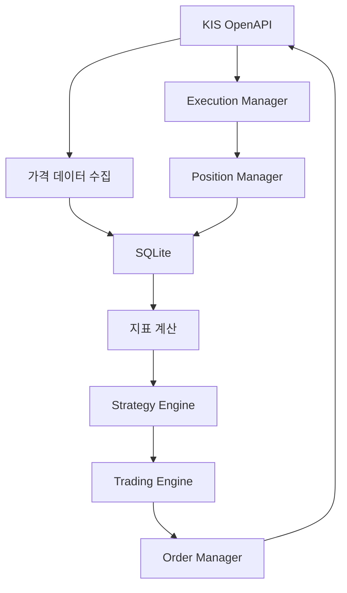

# KIS Rule-Based Auto Trading Program (with 생성형 AI)

한국투자증권 OpenAPI를 활용한 Python 기반 국내주식 자동매매 프로젝트입니다.

시장 데이터 수집부터 기술적 지표 계산, 전략 종합, 주문 전송, 체결 확인, 계좌 동기화와 백테스트까지 하나의 흐름으로 구현했습니다. 단순 수익률 제시보다 **재현 가능한 실행 구조와 전략 변경에 따른 결과 비교**에 초점을 두고 개발하고 있습니다. 아키텍처 설계와 테스트, 결과 검증은 직접 수행했으며, 구현 코드 작성에는 생성형 AI를 도구로 활용했습니다.

> 현재는 한국투자증권 **모의투자 환경**을 기준으로 개발·검증하고 있습니다. `run`, `start`, `manual` 명령은 설정에 따라 실제 주문 요청을 생성할 수 있으므로 계좌와 URL 설정을 반드시 확인해야 합니다.

## 주요 기능

### 데이터 수집 및 저장

- 한국투자증권 OpenAPI 인증과 토큰 캐시
- 국내주식 현재가 및 일봉 데이터 조회
- 종목별 과거 일봉 재시도·연속 수집
- SQLite 기반 가격·주문·체결 데이터 저장

### 지표 및 전략

- 이동평균선(MA)
- RSI
- MACD
- 볼린저밴드
- Strategy Pattern과 Factory Pattern 기반 전략 생성
- BUY·SELL·HOLD 신호 및 신뢰도 산출
- 전략별 가중치와 임계값 기반 최종 신호 결정
- 60일 이동평균 기반 매수 추세 필터

현재 백테스트 전략 가중치는 다음과 같습니다.

| 전략 | 가중치 | 역할 |
|---|---:|---|
| MA Cross | 0.40 | 중·단기 추세 판단 |
| MACD | 0.30 | 추세 모멘텀 확인 |
| RSI | 0.15 | 과매수·과매도 보조 판단 |
| Bollinger Band | 0.15 | 가격 밴드 이탈 보조 판단 |

### 주문·체결·계좌 관리

- 시장가 및 지정가 매수·매도
- 주문 입력 검증과 중복 주문 방지
- 주문 접수·실패·거절 상태 저장
- 미체결 주문 및 누적 체결 수량 동기화
- 체결 내역과 평균 체결가 저장
- 계좌 잔고·보유 수량·매도 가능 수량 조회
- 체결 발생 시 포지션 자동 갱신
- 수동 매수·매도 메뉴

### 자동 실행

- 전체 종목 1회 실행
- 기본 300초 간격 전략 실행 루프
- 기본 10초 간격 체결 동기화 루프
- 자동 실행 중 수동 주문·조회 충돌 방지
- 안전한 중지 및 현재 상태 확인

## 시스템 흐름



자동매매가 시작되면 전략 실행과 체결 동기화가 별도 스레드에서 동작합니다.

```text
전략 루프: 계좌 상태 확인 → 전략 계산 → 주문 판단 → 주문 전송
동기화 루프: 미체결 주문 조회 → 체결 저장 → 주문 상태 갱신 → 포지션 갱신
```

## 백테스트

일봉 기반 Long-only 백테스트 엔진을 구현했습니다.

- 당일 종가까지의 데이터로 신호 생성
- 다음 거래일 시가에 주문 체결
- 미래 데이터 누출 방지
- 수수료와 슬리피지 반영
- 8% 고정 손절과 10% 추적 손절
- 손절 후 5거래일 재진입 제한
- Buy & Hold 수익률 및 초과수익률 비교
- 총수익률·연환산 수익률·MDD·샤프지수·승률 계산
- 전체 기간 지표를 한 번만 계산해 반복 백테스트 성능 개선

### 최근 채택 설정 결과

종목별 최대 1,000일봉, 초기자금 1억 원을 기준으로 전략별 가중치까지 적용한 결과입니다.

| 종목 | 전략수익률 | Buy & Hold | 초과수익률 | MDD | Sharpe | 완료 거래 |
|---|---:|---:|---:|---:|---:|---:|
| 삼성전자 | 138.43% | 315.06% | -176.64% | -33.24% | 1.0184 | 20 |
| SK하이닉스 | 378.44% | 1712.00% | -1333.56% | -33.44% | 1.3193 | 26 |
| NAVER | 19.64% | -29.20% | 48.84% | -32.95% | 0.3071 | 19 |
| 카카오 | 2.34% | -56.17% | 58.51% | -45.14% | 0.1370 | 17 |
| 현대차 | 123.51% | 133.33% | -9.82% | -40.67% | 0.8849 | 19 |

이 결과는 최적화된 투자 성과가 아니라 전략 변경의 영향을 비교하기 위한 실험 결과입니다. 최초 전략부터 손절, 추세 필터, MA·MACD 지속 신호, 재진입 제한과 전략별 가중치까지의 전체 과정은 [backtesting/backtest_log.md](backtesting/backtest_log.md)에 기록했습니다.

### 비용 가정과 한계

- 수수료율 0.015%: 한국투자증권 BanKIS 온라인 국내주식 기본 수수료에 가까운 반올림 가정
- 슬리피지 0.05%: 호가와 실제 체결가 차이에 대한 가정값
- 현재 백테스트에는 매도 시 증권거래세가 반영되지 않아 수익률이 다소 높게 계산될 수 있음
- 주식분할 등 기업행사가 수정주가에 정확히 반영됐는지 추가 검증 필요
- 5개 종목의 과거 성과만으로 전략의 일반화 성능을 보장할 수 없음

## 프로젝트 구조

```text
.
├── api.py                       # 한국투자증권 OpenAPI 호출
├── config.py                    # 환경변수 및 실행 설정
├── data_collector.py            # 과거 일봉 수집
├── database.py                  # SQLite 스키마와 저장소 함수
├── indicator.py                 # 기술적 지표 계산
├── main.py                      # CLI 진입점
├── run_backtest.py              # 다종목 백테스트 실행
├── universe.py                  # 거래 대상 종목
│
├── backtesting/
│   ├── backtest_engine.py       # 체결·손절·자산곡선 처리
│   ├── performance.py           # 성과지표 계산
│   ├── models.py                # 백테스트 결과 모델
│   └── backtest_log.md          # 단계별 실험 기록
│
├── data/
│   ├── loader.py
│   └── preprocess.py
│
├── strategies/
│   ├── base_strategy.py
│   ├── strategy_engine.py
│   ├── strategy_factory.py
│   ├── ma_cross.py
│   ├── macd_strategy.py
│   ├── rsi_strategy.py
│   └── bollinger_strategy.py
│
├── trading/
│   ├── trading_controller.py
│   ├── trading_engine.py
│   ├── order_manager.py
│   ├── execution_manager.py
│   ├── position_manager.py
│   └── data_provider.py
│
└── tests/                       # 전략·DB·주문·체결·컨트롤러 테스트
```

## 설치

### 1. 저장소 복제

```bash
git clone https://github.com/sangbongc/openapi-stock-trading-program.git
cd openapi-stock-trading-program
```

### 2. 가상환경 생성 및 패키지 설치

Windows PowerShell 기준:

```powershell
python -m venv .venv
.venv\Scripts\Activate.ps1
python -m pip install -r requirements.txt
```

### 3. 환경변수 설정

프로젝트 루트에 `.env` 파일을 만들고 본인의 한국투자증권 모의투자 정보를 입력합니다.

```dotenv
KIS_APP_KEY=your_app_key
KIS_APP_SECRET=your_app_secret
KIS_BASE_URL=https://openapivts.koreainvestment.com:29443
KIS_ACCOUNT_NO=your_account_number
ACCOUNT_PRODUCT_CODE=01
```

`.env`, `data/token.json`, 계좌번호와 인증정보는 Git에 커밋하지 마세요.

## 실행 방법

### CLI 실행

```bash
python main.py
```

| 명령어 | 기능 |
|---|---|
| `collect` | 거래 대상 종목의 과거 일봉 수집 |
| `run` | 전체 종목 전략을 한 번 실행 |
| `start` | 전략·체결 동기화 반복 실행 시작 |
| `stop` | 반복 실행 중지 |
| `sync` | 미체결 주문 수동 동기화 |
| `balance` | 계좌 잔고와 보유 종목 조회 |
| `manual` | 수동 매수·매도 메뉴 |
| `status` | 컨트롤러와 작업 스레드 상태 확인 |
| `results` | 최근 종목별 전략 실행 결과 확인 |
| `help` | 명령어 도움말 |
| `exit` | 프로그램 종료 |

처음 실행할 때는 `collect`로 충분한 일봉 데이터를 저장한 다음 `run`으로 전략 결과를 확인하는 순서를 권장합니다.

### 백테스트 실행

```bash
python run_backtest.py
```

백테스트는 SQLite의 `daily_prices` 데이터를 사용하므로 먼저 `collect` 명령으로 대상 종목의 가격 데이터를 수집해야 합니다.

### 테스트 실행

```bash
python -m pytest -q
```

실제 API 호출이 필요한 수동·스모크 테스트와 Mock 기반 단위 테스트를 구분하여 실행하는 것을 권장합니다.

## 데이터베이스

SQLite에는 다음 데이터를 저장합니다.

| 테이블 | 내용 |
|---|---|
| `current_prices` | 종목별 현재가 수집 기록 |
| `daily_prices` | 종목별 일봉 OHLCV |
| `orders` | 주문 요청, 주문번호, 체결 상태와 수량 |
| `executions` | 신규 체결 수량, 평균 체결가와 체결 시각 |

## 검증 범위

다음 흐름을 한국투자증권 모의투자 환경에서 직접 확인했습니다.

- 인증과 토큰 재사용
- 현재가·일봉 조회 및 SQLite 저장
- 시장가 매수·매도 주문 접수
- 주문번호 기반 체결 조회
- 주문·체결 테이블 동기화
- 실제 계좌 잔고 및 보유 종목 갱신
- 수동 주문과 자동 주문 흐름
- 전략 실행과 체결 동기화의 독립 반복 처리

총 160개의 단위 테스트에서는 지표, 전략, 전략 팩토리, 전략 엔진, DB 저장소, 주문·체결·포지션 관리자, 자동매매 엔진과 컨트롤러의 정상·오류 경로를 검증합니다.

## 주요 설계 결정
- 아키텍처 설계와 테스트, 결과 검증은 직접 수행했고, 구현 코드 작성에는 생성형 AI를 도구로 활용했습니다.
- API 호출 지연과 호출 제한을 줄이기 위해 수집된 일봉을 SQLite에 저장하고 Pandas로 지표를 계산합니다.
- 주문 접수와 체결 완료를 분리하여 비동기적인 증권 주문 흐름을 반영합니다.
- 프로그램 시작 시 실제 계좌를 먼저 조회해 로컬 상태와 서버 상태의 불일치를 줄입니다.
- 미체결 주문이 존재하면 동일 종목의 중복 주문 생성을 차단합니다.
- 전략 계산, 주문 처리, 체결 확인과 포지션 관리를 별도 모듈로 분리해 테스트 가능성을 높였습니다.
- 백테스트는 당일 종가 신호를 다음 거래일 시가에 체결해 미래 데이터 누출을 방지합니다.

## 향후 계획

- 증권거래세 및 시장별 거래비용 반영
- 테스트 종목·업종 확대와 아웃오브샘플 검증
- 포트폴리오 단위 자금 배분과 위험관리
- ATR 등 변동성 기반 손절
- 수정주가와 기업행사 처리 검증
- OpenDART 재무정보·공시 분석 프로젝트 연동
- 머신러닝 기반 파라미터 최적화
- WebSocket 기반 실시간 데이터·체결 처리
- 대시보드 및 성과 시각화

## 주의사항

이 프로젝트는 학습과 개발 검증을 위한 개인 프로젝트이며 투자 권유를 목적으로 하지 않습니다. 백테스트 결과는 과거 데이터와 가정에 기반하며 미래 수익을 보장하지 않습니다. 실제 주문 전에는 반드시 모의투자 환경, 계좌번호, API URL, 주문 수량과 `TRADING_DRY_RUN` 설정을 확인하세요.